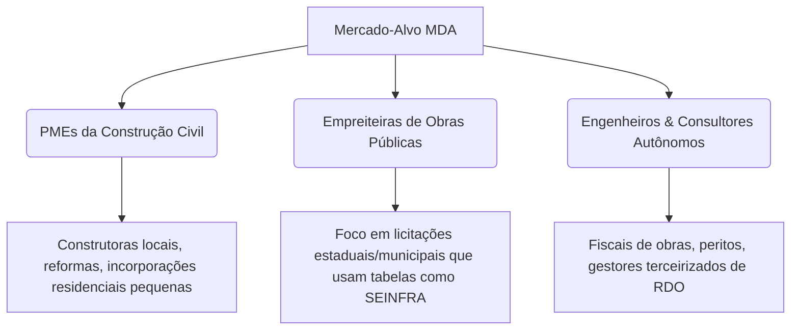

# Análise de Potencial de Mercado — Sistema MDA Acompanhamento de Obras

Este documento apresenta uma análise mercadológica e estratégica sobre o **Sistema MDA Acompanhamento de Obras** (desenvolvido por Francelino Neto Santos), avaliando seu posicionamento, vantagens competitivas, oportunidades de crescimento, concorrência e viabilidade comercial.

---

## 1. Proposta de Valor e Diferenciais Competitivos

O Sistema MDA destaca-se por resolver dores latentes de engenheiros e gestores de obras de pequeno e médio porte que frequentemente são ignorados pelas grandes soluções de ERP do mercado (como Sienge).

### Principais Diferenciais:

*   **Offline-First (Independência de Internet):** A maioria dos canteiros de obras sofre com conectividade instável ou inexistente. O MDA roda 100% localmente no Windows (`SistemaMDA.exe` + SQLite local), exigindo internet apenas para ativação de licença periódica e uso opcional da IA na nuvem.
*   **Facilidade de Instalação e Uso (Desktop Nativo):** Empacotado em executável (.exe) de fácil instalação e certificado pela Microsoft Partner Center para a Windows Store, reduzindo atritos de TI e problemas com antivírus.
*   **Diário EPC & RDO Simplificado:** Padroniza e automatiza a coleta de clima, mão de obra, status de equipamentos e relatório fotográfico em um PDF profissional formatado (evitando quebras de página bruscas).
*   **Plano de Recuperação Algorítmico + IA:** Quando um serviço atrasa, o sistema propõe automaticamente 3 cenários matemáticos reais (Estender Prazo, Aumentar Esforço ou Híbrido) e integra com IA (Gemini ou modelo local via Ollama) para justificar e planejar a ação.
*   **Integração SEINFRA:** Suporte nativo à tabela de preços de referência da SEINFRA (especialmente útil para obras públicas do Nordeste/Ceará), permitindo vincular custos a medições físicas e apurar o progresso financeiro de forma imediata.

---

## 2. Análise do Mercado-Alvo (Target Market)

O sistema MDA possui três grandes segmentos com alto potencial de conversão:

1.  **Pequenas e Médias Construtoras (PMEs):**
    *   *Dor:* Não possuem orçamento ou equipe de TI para implantar sistemas complexos e caros que custam milhares de reais mensais.
    *   *Solução MDA:* Uma ferramenta direta por um preço extremamente acessível (R$ 59,90/mês).
2.  **Empreiteiras e Construtoras de Obras Públicas (Foco SEINFRA/SINAPI):**
    *   *Dor:* Precisam justificar atrasos de forma técnica para órgãos públicos para evitar multas, além de cotar insumos e serviços pelas tabelas oficiais de referência.
    *   *Solução MDA:* Relatório Diário de Obra (RDO) com padrão EPC e link direto com códigos de tabelas de preços oficiais.
3.  **Engenheiros Residentes, Fiscais e Consultores Autônomos:**
    *   *Dor:* Gastam horas montando planilhas de Excel complicadas com Curvas S manuais e relatórios fotográficos no Word para enviar aos clientes.
    *   *Solução MDA:* Geração automatizada de PDFs profissionais de medição física e fotográfica em 5 minutos.

---

## 3. Modelo de Negócio e Monetização

O MDA utiliza um modelo de **Micro-SaaS Desktop**, um formato altamente escalável e de baixíssimo custo operacional:

*   **Preço Atraente:** R$ 59,90/mês (ou plano anual equivalente) está muito abaixo do mercado (sistemas SaaS corporativos partem de R$ 500 a R$ 2.000 mensais).
*   **Custo de Infraestrutura Próximo a Zero:** Os dados e o processamento ocorrem no hardware do próprio cliente (banco SQLite local). O desenvolvedor arca apenas com custos irrisórios do Firebase Firestore para validação de licença (que se enquadra na faixa gratuita para milhares de usuários).
*   **Baixo Atrito de Entrada (Trial Automático):** A lógica de licenciamento do sistema ativa um período de testes de 30 dias automaticamente no primeiro acesso, sem pedir dados sensíveis. O formulário de cadastro surge de forma sutil apenas a cada 3 dias (via background thread) para preparar a conversão.
*   **Alta Margem de Lucro:** Com custos fixos quase nulos, a margem líquida por licença vendida aproxima-se de 95%.

---

## 4. Análise SWOT (F.O.F.A.)

Abaixo, os fatores internos e externos que impactam o sucesso de mercado do MDA:

| **Forças (Internal - Strengths)** | **Fraquezas (Internal - Weaknesses)** |
| :--- | :--- |
| • Operação 100% offline-first (SQLite local). • Assistente de IA híbrido (Gemini ou local via Ollama). • Geração de curva S e planos de recuperação automatizados. • Preço altamente competitivo (R$ 59,90). • Aplicativo certificado na Microsoft Store. • Backup diário compactado automatizado. | • Restrito ao Windows (sem app nativo iOS/Android). • Banco de dados SQLite local dificulta o trabalho colaborativo simultâneo entre escritório e campo. • Dependência de input manual diário pelo engenheiro no canteiro. |
| **Oportunidades (External - Opportunities)** | **Ameaças (External - Threats)** |
| • Expansão para a tabela **SINAPI** (Caixa Econômica - padrão nacional) e **SICRO** (DNIT). • Lançamento de aplicativo móvel simples apenas para fotos e lançamentos rápidos que sincronizam via rede local ou nuvem. • Parcerias com CREA e sindicatos da construção (Sinduscon). • White-labeling para grandes construtoras personalizarem o RDO. | • Concorrentes SaaS tradicionais lançando soluções leves offline. • Pirataria ou quebra do sistema de licenciamento local `.lic` por engenharia reversa. • Mudanças nas regras de segurança do Windows bloqueando o loopback de rede local (`localhost:5000`). |

---

## 5. Análise Comparativa de Concorrentes

| Critério | **Sistema MDA** | **ERP Corporativo (ex: Sienge)** | **Softwares RDO (ex: e-Diário, Mobuss)** | **Planilhas de Excel** |
| :--- | :--- | :--- | :--- | :--- |
| **Preço Estimado** | R$ 59,90 / mês | R$ 1.500+ / mês | R$ 300+ / mês | R$ 0 (com Office) |
| **Dependência de Internet**| Não (Offline-first) | Sim (100% online) | Sim (Maioria online) | Não |
| **Instalação/Uso** | Executável local | Web/Nuvem | Web/App Móvel | Arquivo local |
| **Curva S Automática** | Sim | Sim (Módulo Planejamento) | Apenas logs, sem Curva S robusta | Não (Requer fórmulas) |
| **Planos de Recuperação** | Sim (Algoritmo + IA) | Não (Apenas desvios) | Não | Não |
| **Integração SEINFRA** | Sim | Requer customização paga | Não | Manual |

---

## 6. Plano de Ação e Recomendações Estratégicas

Para potencializar o sucesso do Sistema MDA e transformá-lo em uma solução altamente lucrativa, recomendamos as seguintes ações estruturadas por ordem de impacto:

### Fase 1: Expansão de Base de Dados e Integração (Curto Prazo)
> [!IMPORTANT]
> **Adicionar Base SINAPI (Nacional):** A SEINFRA é excelente para o Ceará/Nordeste, mas a base **SINAPI** é utilizada por 90% das obras públicas do Brasil financiadas pela Caixa Econômica Federal. Adicionar suporte a arquivos SINAPI (Excel/CSV) expandirá o mercado do MDA de regional para nacional instantaneamente.

### Fase 2: Redução de Limitações de Colaboração (Médio Prazo)
*   **Sincronização de Rede Local (Escritório - Campo):** Como o banco está em SQLite, o app pode expor a porta HTTP na rede Wi-Fi local do canteiro. Permitir que outros computadores/celulares na mesma rede acessem o painel (ex: `http://192.168.1.50:5000`) facilita que o apontador faça lançamentos enquanto o engenheiro analisa o painel. *(Nota: O código do Flask já está configurado com `CORS(app, origins="*")` o que facilita essa arquitetura).*
*   **Backup em Nuvem Automatizado (Upsell):** Oferecer um plano "MDA Pro" (ex: R$ 89,90/mês) que realize o backup automático do banco de dados compactado do usuário no Google Drive ou AWS S3 do cliente, ou em servidores MDA na nuvem.

### Fase 3: Estratégia de Marketing e Vendas (Go-To-Market)
*   **Parcerias com Influenciadores de Engenharia:** Divulgar o MDA através de engenheiros no Instagram/YouTube que ensinam planejamento de obras e RDO. O preço baixo facilita a compra por impulso.
*   **SEO de Fundo de Funil:** Criar artigos de blog e landing pages com foco em termos como:
    *   *Como fazer RDO sem internet*
    *   *Modelo de Relatório Diário de Obra padrão EPC*
    *   *Gerador automático de Curva S para obras*
    *   *Importar tabela SEINFRA para controle de obras*
*   **Modelo Freemium Refinado:** O trial silencioso de 30 dias é excelente. Pode-se estender permitindo o uso gratuito vitalício limitado a 1 única obra ativa e até 5 serviços, cobrando o plano de R$ 59,90 apenas para desbloquear obras e serviços ilimitados.

---

### Conclusão

**O Sistema MDA tem um potencial de mercado altíssimo e extremamente viável**, especialmente na categoria de **Micro-SaaS**. Sua arquitetura offline-first e distribuição via desktop resolvem o problem de infraestrutura e conectividade de canteiros remotos de forma muito superior às pesadas plataformas web. 

Ao focar em engenheiros autônomos, fiscais e construtoras de obras públicas regionais (alavancando a base SEINFRA/SINAPI), o produto oferece uma relação custo-benefício imbatível com custos de operação e servidores praticamente nulos para o desenvolvedor.
